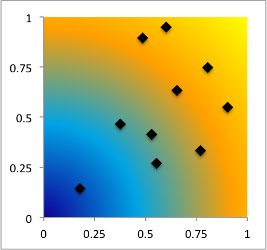
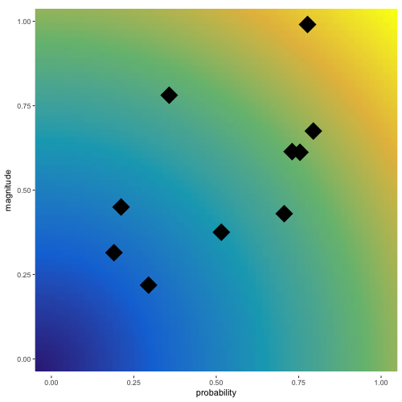

```{r setup, include = FALSE}
source("~/projects/parula/code/parula.R")
library(knitr)
knitr::opts_chunk$set(echo = TRUE, fig.align = 'center')
knitr::opts_knit$set(root.dir = "~/projects/gradient-ggplot2-bg/")
```

I worked on a project not too long ago that required me to present the relationship between the magnitude and probability of various scenarios. The goal was to communicate that the 'materiality' of a scenario is a function of radial distance in two dimenions.

The first thing that came to mind was to color-code the background in polar coordinates from cold to hot. Something like:
```{r, echo = F}

```

This type of visualization is trivially easy to create in Excel, but not immediately obvious how to implement in ggplot2.

Here's my solution, the hard part of which is stolen shamelessly from this stackoverflow solution: http://stackoverflow.com/questions/11070101/2d-color-gradient-plot-in-r

First, let's generate some data:
```{r}
n <- 10

set.seed(20150415)
x <- runif(n, 0, 1)
y <- runif(n, 0, 1)

data <- data.frame(probability = x, magnitude = y)
```


Ok, we're now in a position to start. We'll heavily rely on the 'scales' library (also by the productive Hadley Wickham). I'm working with the assumption that our plot will be square, so the lengths of our x and y vectors will be the same when creating our map.
```{r, fig.align = 'center', fig.height = 3, fig.width = 3}
library(scales)

# get matrix of values corresponding to the range of the desired color map
# we reverse the values of the 'X' vector so it can map to to an
# increasing x axis in cartesian coordinates
M <- outer(X = 50:0, Y = 0:50, FUN = function(x,y) { sqrt( x^2 + y^2 ) })

# this builds the function pal() that will map values to our color map
pal <- gradient_n_pal(parula(6), 
                      values = c(min(M), median(M), max(M)),
                      space = 'Lab')
# finally, cram our colors into a matrix
colors <- matrix(pal(M), nrow(M))

library(grid)
# rasterize so we can use our beautiful background
my_grob <- rasterGrob(colors, interpolate = TRUE)

# let's take a look at our work!
grid::grid.raster(colors)
```


Finally, putting it all together for our final product:
```{r exclude = FALSE}
library(ggplot2)

png("./img/my_plot.png", height = 500, width = 500)
ggplot(data, aes(x = probability, y = magnitude)) + 
  annotation_custom(my_grob, xmin = -Inf, xmax = Inf, ymin = -Inf, ymax = Inf) +
  scale_x_continuous(limits = c(0,1)) +
  scale_y_continuous(limits = c(0,1)) +
  geom_point(shape = 18, size = 10) +
  # the sizing isn't perfect, so we remove the default background panel 
  theme_bw() +
  theme(
    panel.border = element_blank(),
    panel.grid = element_blank()
  )
dev.off()
```

```{r, echo = F, out.width = "50%"}

```

Not so bad!

I write this image to disk to avoid issues with R dynamically resizing the device output based on the window dimensions. This is an issue since for our plot to look good, the dimensions are constrained to our desired aspect ratio. 

Certainly there are some limitations to this solution. For one, what we're calling a background is actually just a background-sized image that lays on top of the true background. To that effect, we're now limited in our ability to display other background features like gridlines, larger axis ticks, etc. 


